# 🛋️🍺 SofaCervecero

**Hub de juegos para PC (Windows).** Un único sitio para ver, organizar y lanzar *todos* tus
juegos —estén instalados o no, vengan de Steam, de otra tienda, o sean una carpeta suelta en un
disco externo— y para preparar la partida en el sofá con mando, en el monitor que toque.

Tauri v2 · Rust (core) + Svelte 5 / TypeScript (UI) · SQLite.

---

## ⚠️ Antes de nada: estado del proyecto

**Esto está en desarrollo activo, no es un producto terminado.** Es normal encontrar bugs,
funcionalidades a medias, pantallas sin pulir del todo y piezas que cambian de un commit a otro.
Se publica así, en construcción, no como una release estable.

**Sobre el mando (gamepad):** el soporte de mando se ha implementado y probado activamente con
**mando de Xbox**, pero **nunca con una videoconsola real conectada**. Si tu mando de Xbox o
PlayStation está emparejado también con una consola, el botón de "encendido" del mando puede
encenderla a ella, no (solo) al PC. Esta app está pensada para usarse con el PC como único
destino del mando —o, como mucho, con un mando (p. ej. DualShock/DualSense) dedicado
exclusivamente a ese PC—, no para compartir un mando ya vinculado a una consola.

---

## La idea

Tener **bien ordenados todos los juegos de todos tus discos**. Saber qué tienes instalado, pero
también **qué tenías instalado**. Es la típica situación: no sabéis a qué jugar con tus amigos, no
recordáis qué habéis tenido instalado cada uno en algún momento. Con SofaCervecero es fácil
recordarlo, porque la app **no borra nada**: un juego desinstalado conserva su categoría, sus
argumentos de lanzamiento, su carátula y su historial. Desinstalar no es olvidar.

Y para el día a día en el sofá: el **Modo Sofá** está pensado para los juegos **couch-coop o a
pantalla partida** — prepara la sesión, envía la ventana directa al monitor/TV que toque, y se
maneja entero con mando desde el propio sofá.

---

## Capturas de pantalla

### Biblioteca

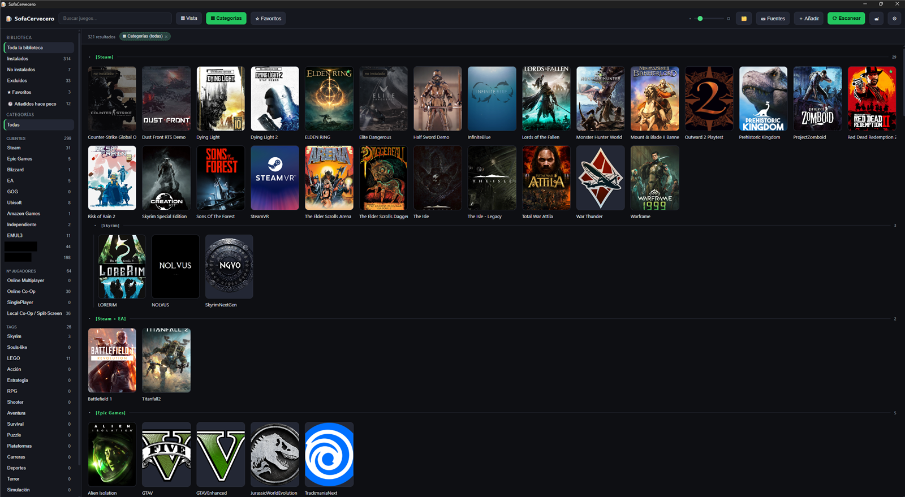
**Biblioteca categorizada.** Todo lo que tienes instalado —y lo que has tenido— de todas las
fuentes (Steam, carpetas propias, emuladores…) en una sola cuadrícula, agrupada sola por los ejes
de categorías que definas.

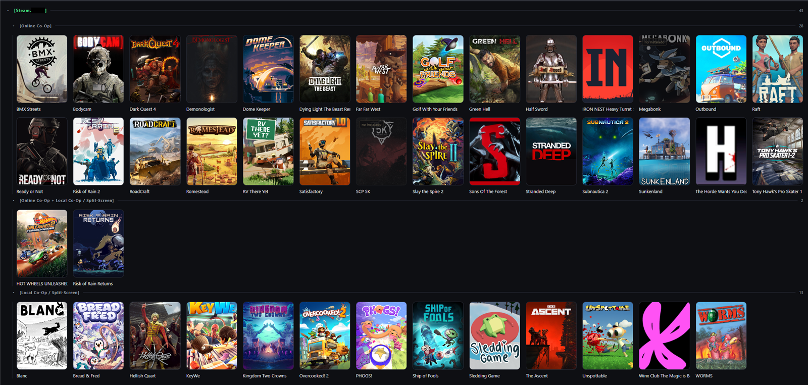
**Biblioteca de juegos específicamente con Online Co-Op, Couch Co-Op, Split-Screen, etc.** —
cómodo de identificar, estén donde estén. Filtrando por estas categorías se ve de un vistazo qué
hay instalado para jugar juntos, sin que importe en qué tienda o carpeta esté cada juego.

### Organización de cada juego

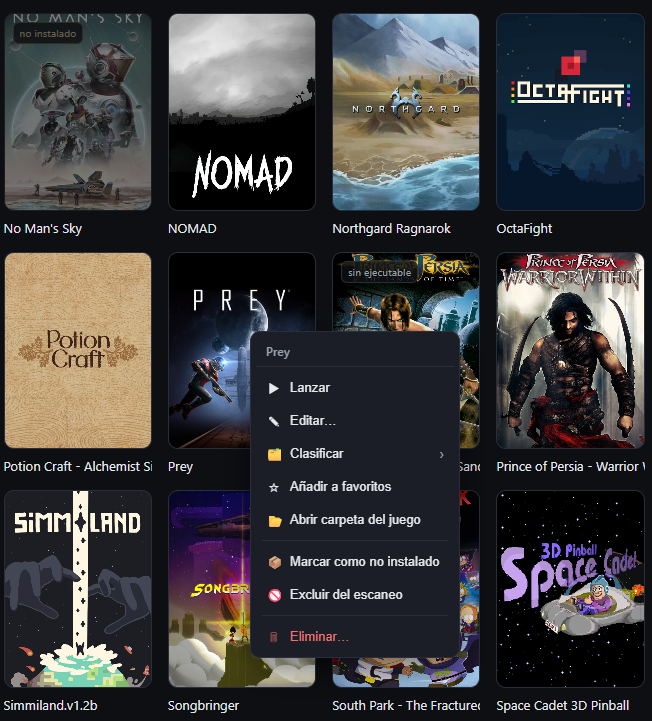
**Opciones con clic derecho sobre una app.** Lanzar, editar, clasificar en categorías, marcar
como favorito, abrir su carpeta, cambiar de estado o eliminarlo — todo desde un menú contextual
propio, también accesible con el mando.

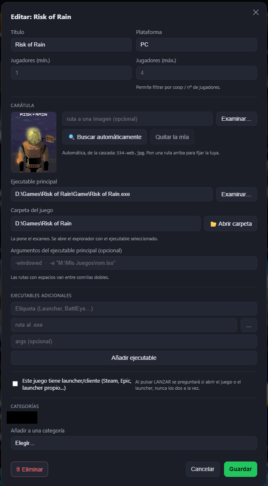
**Opciones al editar una app/juego.** Título, plataforma, número de jugadores, carátula,
ejecutable principal y sus argumentos, y categorías — todo editable a mano y protegido frente al
reescaneo en cuanto lo tocas.

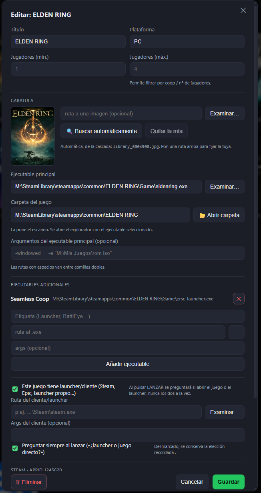
**Editar una app y añadir launchers específicos, argumentos adicionales o ejecutables extra.**
Por ejemplo, Elden Ring se puede lanzar por Steam, sin iniciar Steam, o por un ejecutable aparte
—el del mod *Seamless Co-op*— todo configurado desde la misma ficha.

### Lanzar un juego

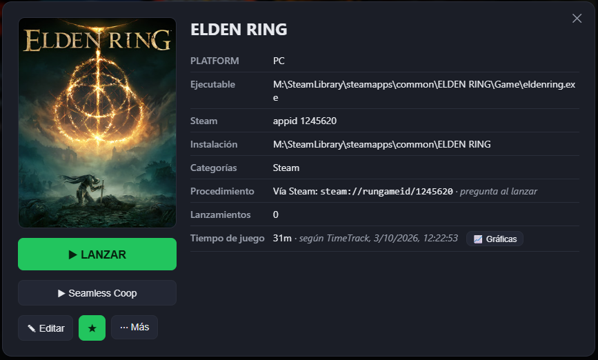
**Distintas opciones para iniciar el juego configurado previamente.** La ficha del juego ofrece
cada forma de lanzarlo que le hayas añadido —aquí, Elden Ring normal o directo a Seamless Co-op—
junto a su tiempo de juego real.

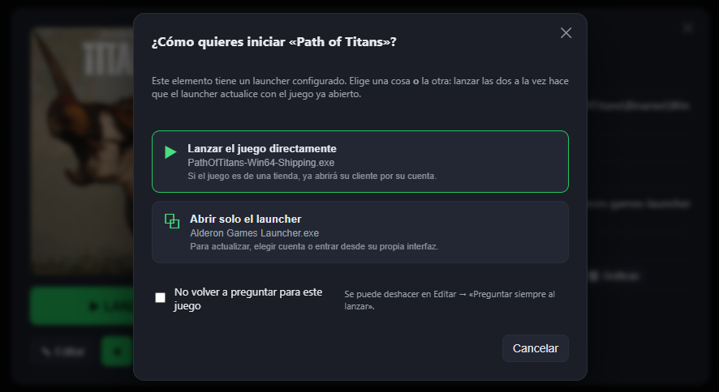
**Caso de un juego con un launcher independiente**, que no es el de una tienda como Steam, EA o
Epic Games (aquí, el launcher propio de AlderonGames para *Path of Titans*). Sirve con cualquier
launcher y cualquier juego: elegir si abrir el juego directo o pasar antes por su launcher.

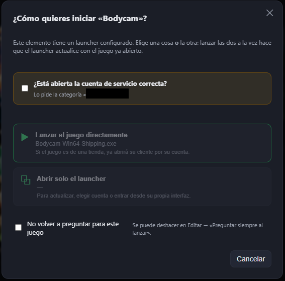
**Para juegos en Steam en distintas cuentas**, se puede configurar un aviso que pide confirmar la
cuenta específica antes de lanzar; Steam permite cambiar de cuenta con el mando de forma fácil, se
cambia a la cuenta correspondiente y el juego se abre. Este mismo mecanismo también sirve como un
**aviso preventivo** para recordar cualquier cosa: el mensaje se personaliza, así que vale igual
para un «¿has cerrado X app antes de iniciar esta?» que para preguntarte si has apagado el horno.

### Aspecto y mando

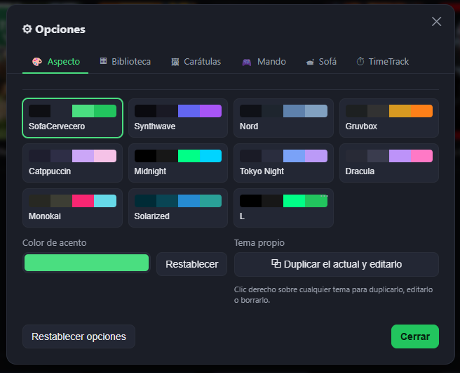
**Temas predeterminados, con posibilidad de editar cada color y elemento.** Varios temas de
fábrica más los tuyos propios, con vista previa en vivo y color de acento configurable.

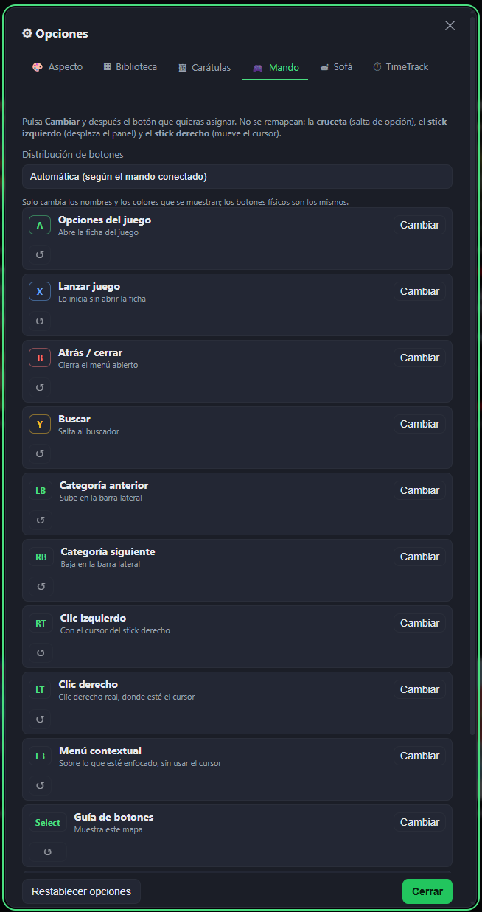
**Posibilidad de mapear cada control del mando**, tanto para mando de Xbox como de PlayStation.
El stick derecho hace de **cursor** y mueve el ratón, y los **triggers hacen de clic izquierdo y
derecho** — la app entera se puede manejar sin tocar el teclado ni el ratón.

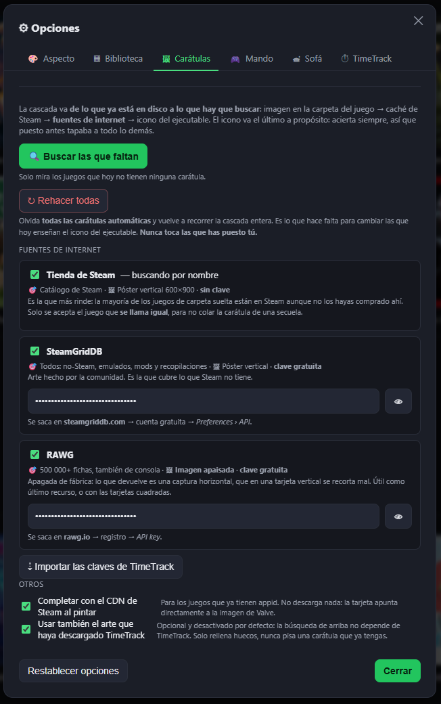
**Posibilidad de añadir claves de API para buscar carátulas de juegos menos conocidos.** La
cascada ya cubre sola lo más habitual (carpeta del juego, caché de Steam, tienda de Steam);
SteamGridDB y RAWG amplían esa búsqueda a lo que no se reconoce por defecto, con claves gratuitas
y opcionales.

### Modo Sofá

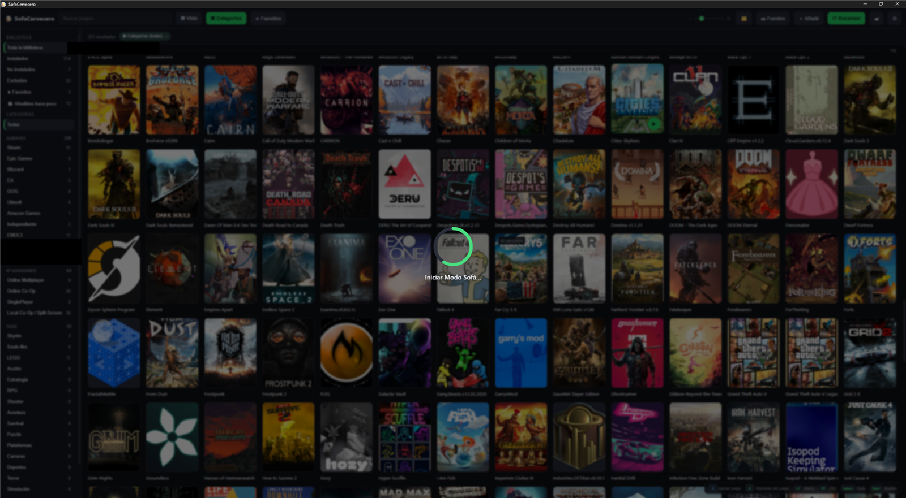
**¡Modo Sofá disponible!** Se lanza desde la propia biblioteca y prepara la sesión para jugar
desde el sofá, mando en mano.

---

## Qué hace hoy

### Biblioteca
- **Tres orígenes de juegos**: carpeta-biblioteca (una subcarpeta = un juego), app/`.exe` suelto, y
  **Steam** (se detecta solo y lee sus `libraryfolders.vdf` + `appmanifest_*.acf`).
- Heurística de detección de ejecutable con recursión, exclusiones y *scoring*; lo que corriges a
  mano no se pisa en los reescaneos.
- **Tres estados por juego**: instalado · no instalado · excluido, más **★ Favoritos** como marcador
  independiente. Nada se borra al desinstalar o excluir, salvo que lo pidas tú.
- **Añadidos recientemente**, con ventana configurable.
- **Escaneo no bloqueante**, con progreso real y opción de cancelar conservando lo ya encontrado.
- **El reescaneo no pisa lo que has curado**: nombre, ejecutable y carátula elegidos a mano
  sobreviven. Encontrar la carpeta de un juego marcado "No instalado" no lo reinstala —encontrar
  su ejecutable, sí.
- **Una carpeta, una fuente**: añadir una ruta que ya existe la reutiliza en vez de duplicarla.
- Abrir la carpeta del juego en el explorador, con el ejecutable ya seleccionado.

### Lanzamiento
- Ejecutable directo con argumentos, ejecutables adicionales por juego, y launcher/cliente previo
  (por ejemplo, un launcher propio antes del juego).
- **Popup de lanzamiento**: si hay launcher, pregunta *juego* o *launcher* — nunca los dos a la vez.
  La respuesta se puede recordar por juego.
- Lanzamiento de Steam vía `steam://rungameid/<appid>`, con aviso si el juego pide una cuenta
  distinta de la que está activa.
- Cada lanzamiento queda registrado.

### Organización
- **Categorías en árbol de ejes** (p. ej. *Clientes*, *Nº de jugadores*, *Tags*): anidables,
  reordenables a mano, con herencia.
- **Filtros combinables**: estado, categoría, favoritos, recientes, texto, origen, plataforma, nº
  de jugadores, jugado/sin jugar.
- **Panel de Vista**: orden por título, última vez jugado, tiempo jugado, nº de jugadores o fecha
  de añadido (con la dirección aparte); la cuadrícula se puede partir en secciones por hasta tres
  ejes de categoría encadenados. El modo "Categorías (todas)" encadena todos los ejes: se ven
  todos los juegos y ninguno se repite.
- **Secciones plegables**, con su estado recordado entre sesiones.
- **Menú contextual propio** en tarjetas, filas y cabeceras de sección: lanzar, editar, clasificar
  (con submenú de árbol, marcando varias categorías seguidas), favoritos, abrir carpeta, cambiar de
  estado, eliminar.
- **Tareas en segundo plano** (escaneo, carátulas) que no bloquean la interfaz y se pueden cancelar.

### Integración y aspecto
- **TimeTrack**: tiempo jugado real por juego, leído de su API local y cacheado. El hub no arranca
  ni cierra TimeTrack — solo lee sus datos. Incluye filtro por horas jugadas y gráficas por juego.
- **Carátulas**, con una cascada de búsqueda única: imagen de la carpeta → arte propio del usuario
  en Steam y su caché → tienda de Steam (por nombre) · SteamGridDB · RAWG → icono del `.exe` como
  último recurso. La carátula elegida a mano queda intocable salvo que pidas rehacerla.
- **Varios temas** predefinidos más temas propios, con editor en el sitio (editar, duplicar,
  renombrar, borrar) y vista previa en vivo. Color de acento configurable. Vista en cuadrícula o
  lista, tarjeta rectangular o cuadrada, tamaño ajustable.
- **Ajustes por pestañas**: Aspecto · Biblioteca · Carátulas · Mando · Sofá · TimeTrack.

### Mando (Xbox / PlayStation / Steam Controller)
- Cruceta para navegar, stick izquierdo para desplazar, stick derecho mueve el cursor del sistema,
  gatillo para hacer clic, L3 abre el menú contextual.
- Botones remapeables, con guía completa y ayuda contextual en pantalla.

### Modo Sofá
- Selector de pantalla para elegir a qué monitor/TV enviar la ventana.
- Pensado para sesiones couch-coop / pantalla partida: preparar la sesión y los juegos antes de
  sentarse en el sofá, y volver al hub al salir del juego.

### Servicio (cómo vive en el sistema)
- **Una sola instancia**: relanzar el `.exe` abre el hub que ya está en la bandeja, en vez de
  duplicar el proceso.
- **Recuerda tamaño y posición** de la ventana; si la posición guardada cae fuera de todas las
  pantallas conectadas, se descarta en vez de abrir en un escritorio inexistente.
- **Core residente + ventana bajo demanda**: cerrar la ventana (✕) no cierra la app — libera el
  WebView2 (el grueso de la RAM) y deja un core ligero en la bandeja del sistema. Para salir de
  verdad: clic derecho en el icono de la bandeja → *Salir*.

---

## Stack técnico

| Capa | Tecnología |
|---|---|
| Core / backend | Rust 2024, [Tauri v2](https://tauri.app/) |
| UI | [Svelte 5](https://svelte.dev/) + TypeScript, [Vite](https://vitejs.dev/) |
| Datos | SQLite (vía [`rusqlite`](https://crates.io/crates/rusqlite), embebido) |
| Cliente HTTP (core) | [`ureq`](https://crates.io/crates/ureq) + `native-tls` (TLS vía schannel de Windows) |
| Integración Windows | `windows-sys` (mando/XInput, pantallas, cursor del sistema, foco de ventana) |

La app es **solo Windows** por ahora: usa WebView2 como motor de interfaz y varias llamadas Win32
directas (enumeración de pantallas, lectura de la cuenta activa de Steam en el registro, manejo
del cursor desde el mando).

---

## Requisitos

Para **compilar**:
- [Rust](https://rustup.rs/) (`stable-x86_64-pc-windows-msvc`) + herramientas de compilación de
  MSVC (Visual Studio Build Tools con el workload de C++).
- [Node.js](https://nodejs.org/) 18 o superior, con npm.
- WebView2 Runtime (ya viene instalado de serie en Windows 11; en Windows 10 puede requerir
  instalarlo aparte) — solo hace falta para *ejecutar*, no para compilar.

Para **usarla** (una vez instalada o descargada): Windows 10/11 con WebView2 Runtime (ya viene de
serie en Windows 11).

---

## Instalación / cómo probarla

La forma más rápida es descargar la última build desde
**[Releases](https://github.com/InfectedBit/SofaCervecero/releases/latest)**. Hay dos opciones,
ambas `x64` (el nombre del archivo incluye la versión, p. ej. `_0.1.0_`):

- **`SofaCervecero_<versión>_x64-setup.exe`** — instalador (recomendado): entrada en el menú
  inicio, desinstalador, y gestiona WebView2 si falta en el sistema.
- **`SofaCervecero_<versión>_x64-portable.exe`** — portable: se copia y se ejecuta, sin instalar
  nada.

> Las releases están marcadas como **pre-release**: es una build en desarrollo activo, no una
> versión estable — ver el aviso al principio de este documento.

También se puede compilar desde el código, por ejemplo para probar la rama `main` al día:

```powershell
git clone <url-de-este-repositorio>
cd SofaCervecero/app
npm install
npm run tauri dev      # modo desarrollo, con recarga en caliente de la interfaz
```

Para generar un `.exe` o un instalador propios:

```powershell
npm run tauri build                   # instalador NSIS + .exe
npm run tauri build -- --no-bundle    # solo el .exe, sin instalador
```

También hay scripts de PowerShell en [`scripts/`](scripts/) que hacen lo mismo con algunas
comprobaciones extra (cierran instancias residentes antes de recompilar, detectan si el `.exe` ha
quedado desactualizado respecto al código, etc.):

| Quiero… | Comando |
|---|---|
| Usar la app como la usaría cualquiera (build real) | `.\scripts\run.ps1` |
| Tocar la interfaz con recarga en caliente | `.\scripts\dev.ps1` |
| Compilar solo el `.exe`, sin instalador | `.\scripts\build.ps1 -NoBundle` |
| Generar el instalador | `.\scripts\build.ps1` |
| Comprobar que no se ha roto nada (tests) | `.\scripts\test.ps1` |
| Empezar de cero (borrar artefactos de build) | `.\scripts\clean.ps1` |

Si PowerShell bloquea la ejecución de los scripts por política de ejecución:
```powershell
powershell -ExecutionPolicy Bypass -File .\scripts\build.ps1
```

> ⚠️ No compiles con `cargo build --release` directamente: el frontend se incrusta en el binario
> al compilar, y `cargo` a secas no se entera de que `app/dist` ha cambiado — puede dejarte un
> `.exe` con la interfaz vieja sin avisar. Usa siempre `npm run tauri build` o los scripts.

### Primer arranque
Al abrir la app por primera vez la biblioteca estará vacía: hay que añadir al menos una **fuente**
(una carpeta donde tengas juegos instalados, o dejar que detecte Steam solo) desde el botón
**Fuentes** de la barra superior, y lanzar un escaneo.

### Dónde guarda sus datos
| Qué | Dónde |
|---|---|
| Biblioteca, categorías, estados, tiempo jugado | `%APPDATA%\com.sofacervecero.hub\library.db` (SQLite) |
| Carátulas extraídas/descargadas | `%APPDATA%\com.sofacervecero.hub\icons\` |
| Tema, vista, tamaño de tarjeta, mapeo del mando | `localStorage` del propio WebView |

Borrar `library.db` equivale a empezar de cero (hay que volver a añadir fuentes y escanear). El
esquema se migra solo al abrir una versión más nueva, así que no hace falta borrarlo al
actualizar.

### El ciclo de vida de la ventana
Cerrar la ventana con la ✕ **no cierra la app** — es intencionado, para no pagar el coste en RAM
del WebView2 cuando no la estás usando. Para recuperar la ventana: clic en el icono de la bandeja,
o volver a lanzar el `.exe` (no duplica el proceso). Para salir de verdad: clic derecho en la
bandeja → *Salir*.

---

## Desarrollo

```powershell
cd app
npm install
npm run dev            # solo el frontend (Vite), sin Tauri
npm run tauri dev       # app completa con recarga en caliente
npm run check            # svelte-check (tipado de la UI)
```

Los tests del núcleo Rust se ejecutan con `cargo test` desde `app/src-tauri`, o con
`.\scripts\test.ps1` desde la raíz (tests + build del frontend).

Estructura del repositorio:
```
app/
  src/            frontend: Svelte 5 + TypeScript (componentes, lib/, estilos)
  src-tauri/      core: Rust — biblioteca, escaneo de fuentes, lanzamiento, mando,
                  pantallas/Modo Sofá, TimeTrack, carátulas, servicio en bandeja
scripts/          PowerShell: dev, run, build, test, clean, versionado
```

---

## Dependencias (resumen)

**Frontend** (`app/package.json`): `@tauri-apps/api`, `@tauri-apps/plugin-dialog`,
`@tauri-apps/plugin-opener`, Svelte 5, Vite, TypeScript.

**Core** (`app/src-tauri/Cargo.toml`): `tauri` (con `tray-icon`, `image-png`,
`protocol-asset`), `tauri-plugin-opener`, `tauri-plugin-dialog`, `tauri-plugin-single-instance`,
`serde`/`serde_json`, `rusqlite` (SQLite embebido, *bundled*), `ureq` + `native-tls` (HTTP/TLS),
`winreg` y `windows-sys` (integración con Windows: registro, pantallas, XInput, foco de ventana).

---

## Limitaciones conocidas / cosas que vigilar

Por ser un proyecto en desarrollo activo, hay varias cosas que conviene saber antes de usarlo:

- **Solo Windows.** No hay (ni está previsto, de momento) soporte para Linux o macOS.
- **No es portable del todo todavía**: la base de datos siempre va a `%APPDATA%`, no junto al
  `.exe`.
- **Sin firma digital**: Windows SmartScreen puede avisar en la primera ejecución del instalador.
- **El mando no se ha probado con hardware de consola real** detrás — ver el aviso al principio de
  este documento.
- **Tráfico de red para carátulas**: el core consulta la tienda de Steam, SteamGridDB y RAWG para
  buscar carátulas por nombre. Se puede desactivar fuente por fuente desde Ajustes.
- Es software en construcción: espera funcionalidades a medias, pantallas sin pulir y comportamiento
  que puede cambiar de una versión a otra.

---

## Licencia

Todos los derechos reservados. Este repositorio se publica con fines de referencia, consulta y
portfolio — no se concede licencia de uso, copia, modificación o distribución del código sin
permiso expreso del autor.
